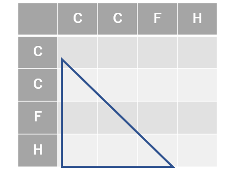

# 与えられた原子のリストから分子をEnumerationする方法

https://future-chem.com/rdkit-graph/  
ここ説明されている隣接行列を使う。隣接行列を列挙し、それをMolオブジェクトに変換することを考える。



左下の三角形の成分だけ考えればいいなぜなら
・右上の成分は左下と対称

```python
bond_mtx[i,j]=bond_mtx[j,i]
```

・対角成分は横方向の行の結合数をすべて足し、それを原子価から引けばいい

```python
valence_num-np.sum(bond_mtx[i,:])
```


3行目のCの結合数を考える。C の価電子は4。つまりxとyの結合数は足して4以下になればいい 。
つまり$𝑥+𝑦\le4$となる0以上の整数x,yの組み合わせを列挙すればいい。

https://math.nakaken88.com/textbook/expert-combination-of-integers-whose-sum-is-the-given-value/  
ここにあるように足してn以下になる整数の組は一つ変数を増やし、足してnになる整数の組と考えられる。
つまり$𝑥+𝑦+𝑧=4$となる0以上の整数x,y,zの組み合わせ

そして↑のサイトにあるように足してnになる整数の組はボール「○」と仕切り「|」の並び方で考えられる。今回の場合は「○ ○ ○ ○ ||」の並び替えなので$6!/4!2!$=15通りとなる。


https://manabitimes.jp/math/1101  
そしてこのサイトにあるように足してnになる整数の組の組み合わせは、重複組み合わせの問題となる。
つまり𝑥+𝑦+𝑧=4となる0以上の整数x,y,zの組み合わせは
たくさんの赤、青、黒の三種類の玉から、4つを選ぶ組み合わせと同じと言える。
このとき赤の玉の数がx、青の玉の数がy、黒の玉の数がzとなる。

重複組み合わせはpythonではitertools.combinations_with_replacementで列挙できる。
```python
itertools.combinations_with_replacement([0,1,2],4)  
>>[(0, 0, 0, 0), (0, 0, 0, 1), (0, 0, 0, 2), (0, 0, 1, 1), (0, 0, 1, 2), (0, 0, 2, 2), (0, 1, 1, 1), (0, 1, 1, 2), (0, 1, 2, 2), (0, 2, 2, 2), (1, 1, 1, 1), (1, 1, 1, 2), (1, 1, 2, 2), (1, 2, 2, 2), (2, 2, 2, 2)]
```
と15通り列挙できる。ここで0が赤の玉、1が青の玉、2が黒の玉と当てはめれば  

x=「0の個数」、y=「1の個数」、z=「2の個数」  

として組み合わせが列挙できた。
